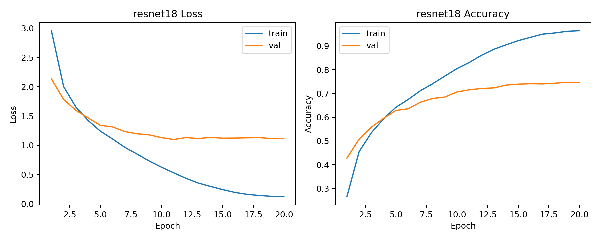
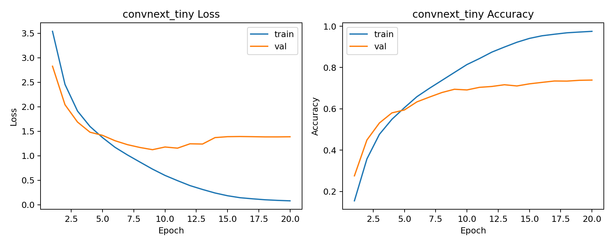
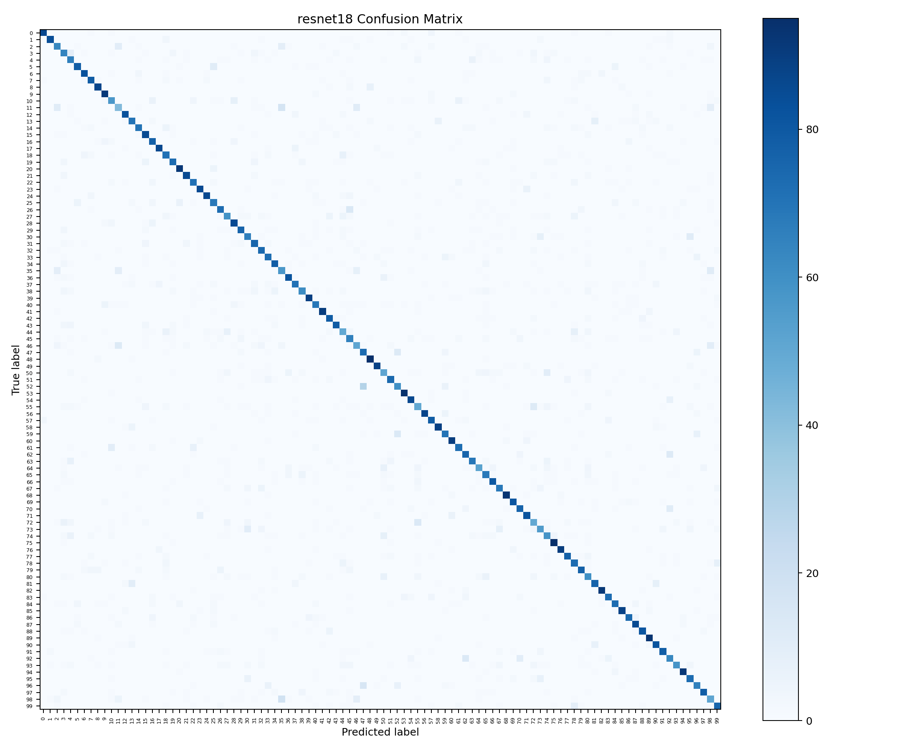
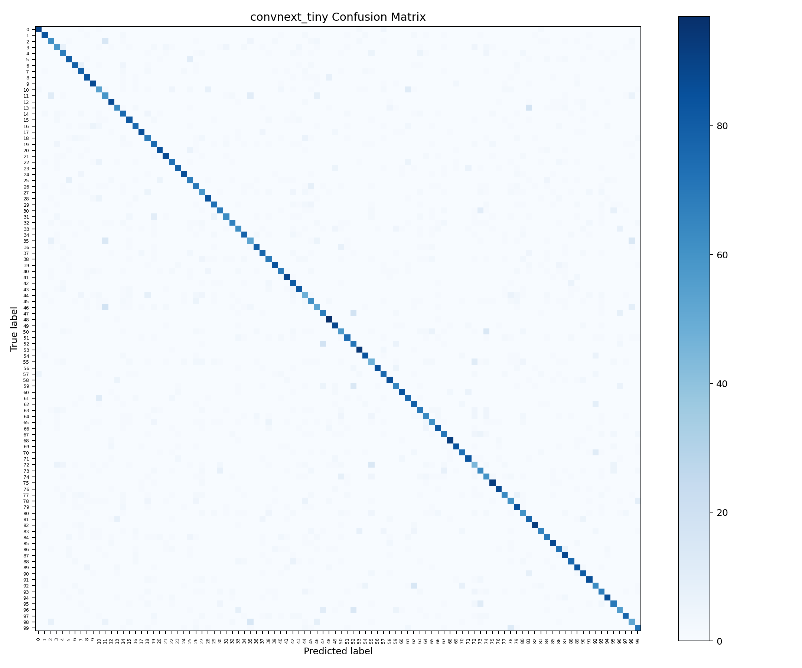
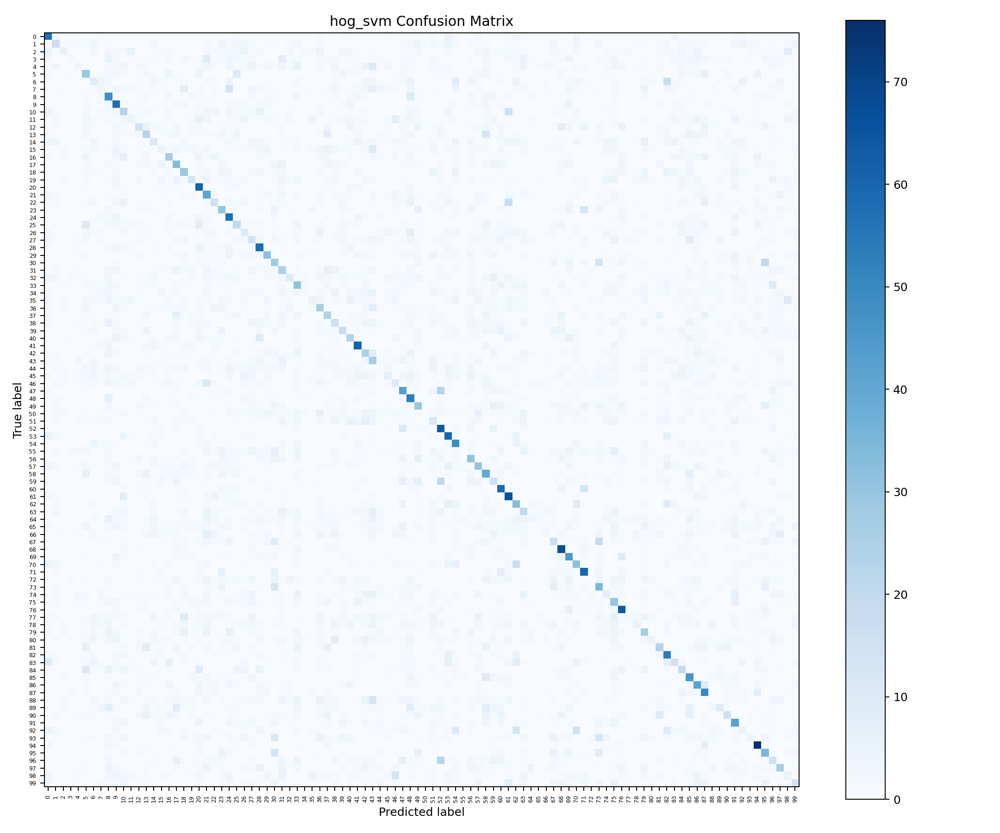
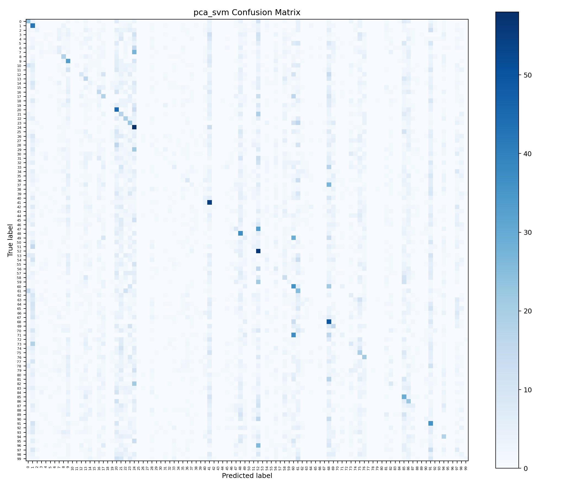

# CIFAR-100 Results

The final benchmark was trained on CIFAR-100 with seed `42` for 20 epochs. Deep models were trained on a Tesla V100-SXM2 16GB GPU.

## Summary

| Method | Accuracy | Macro Precision | Macro Recall | Macro F1 |
|---|---:|---:|---:|---:|
| ResNet18 | **74.71%** | **74.90%** | **74.71%** | **74.67%** |
| ConvNeXt-Tiny | 73.93% | 74.25% | 73.93% | 73.92% |
| HOG + SVM | 25.92% | 22.10% | 25.92% | 22.60% |
| PCA + SVM | 9.02% | 7.20% | 9.02% | 5.58% |

ResNet18 achieved the best validation accuracy. ConvNeXt-Tiny was close behind and provides a modern transfer-learning comparison. The classical methods are useful baselines, but they are not competitive on 100-class recognition.

## Training Curves

### ResNet18

Final epoch:

- train accuracy: 96.43%
- validation accuracy: 74.69%
- best recorded accuracy: 74.71%

### ConvNeXt-Tiny

Final epoch:

- train accuracy: 97.54%
- validation accuracy: 73.93%
- best recorded accuracy: 73.93%

Both deep models show a clear generalization gap. The current result is strong enough for the benchmark, but future tuning should focus on regularization and lower learning rates rather than simply increasing epoch count.

## Confusion Matrices

### ResNet18

### ConvNeXt-Tiny

### Classical Baselines

## Strong and Weak Classes

### ResNet18

Strongest classes:

- `skunk`: 95%
- `motorcycle`: 95%
- `orange`: 94%
- `road`: 93%
- `tractor`: 93%
- `chair`: 92%
- `sunflower`: 92%
- `wardrobe`: 92%

Weakest classes:

- `boy`: 42%
- `seal`: 50%
- `lizard`: 50%
- `otter`: 50%
- `man`: 51%
- `mouse`: 51%
- `woman`: 51%
- `possum`: 52%

### ConvNeXt-Tiny

Strongest classes:

- `motorcycle`: 97%
- `orange`: 94%
- `road`: 92%
- `skunk`: 92%
- `sunflower`: 92%
- `apple`: 90%
- `lawn_mower`: 89%
- `tank`: 88%

Weakest classes:

- `seal`: 45%
- `otter`: 47%
- `lizard`: 48%
- `woman`: 52%
- `man`: 52%
- `girl`: 52%
- `bowl`: 54%
- `willow_tree`: 56%

## Major Confusions

Top ResNet18 confusion pairs:

| True Label | Predicted Label | Count |
|---|---:|---:|
| oak_tree | maple_tree | 29 |
| woman | girl | 18 |
| boy | girl | 17 |
| willow_tree | maple_tree | 15 |
| crab | lobster | 14 |
| pine_tree | oak_tree | 13 |
| seal | otter | 13 |
| tulip | poppy | 13 |

Top ConvNeXt-Tiny confusion pairs:

| True Label | Predicted Label | Count |
|---|---:|---:|
| man | boy | 18 |
| maple_tree | oak_tree | 18 |
| oak_tree | maple_tree | 18 |
| bus | streetcar | 17 |
| baby | boy | 15 |
| tulip | poppy | 15 |
| woman | girl | 15 |
| girl | boy | 14 |

These mistakes are semantically reasonable for CIFAR-100: similar tree species, related vehicles, flowers, small animals, and human categories are difficult to separate at low image resolution.

## Interpretation

The benchmark shows a clear progression in representation power:

1. `pca_svm` performs poorly because flattened grayscale pixels do not capture robust object structure.
2. `hog_svm` improves the baseline by using edge and color information, but hand-crafted features still struggle with fine-grained 100-class recognition.
3. `resnet18` learns much stronger visual features and achieves the best final accuracy.
4. `convnext_tiny` demonstrates modern transfer learning and nearly matches ResNet18 under the current training setup.

The next most useful improvement is not just more epochs. The deep models already fit the training set strongly, so future work should test lower learning rates, label smoothing, RandomErasing, MixUp/CutMix, and stronger weight decay.
